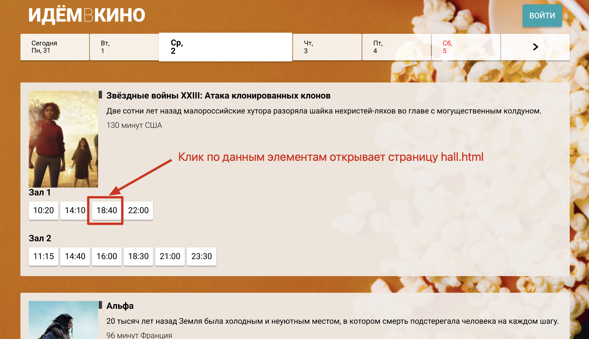
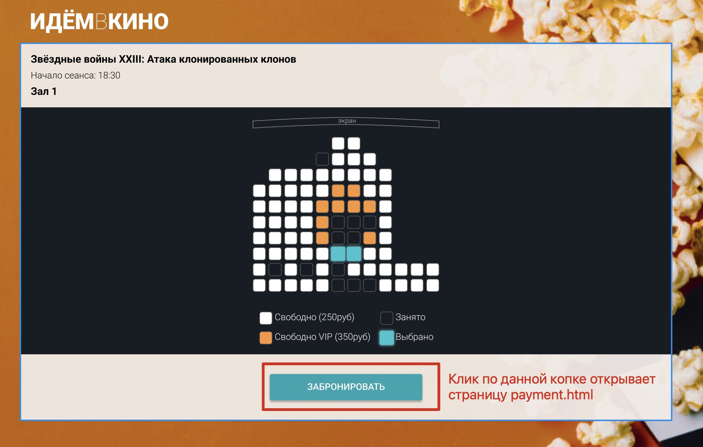
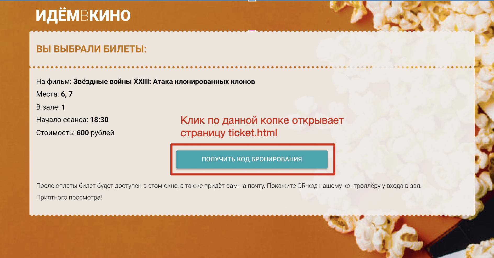
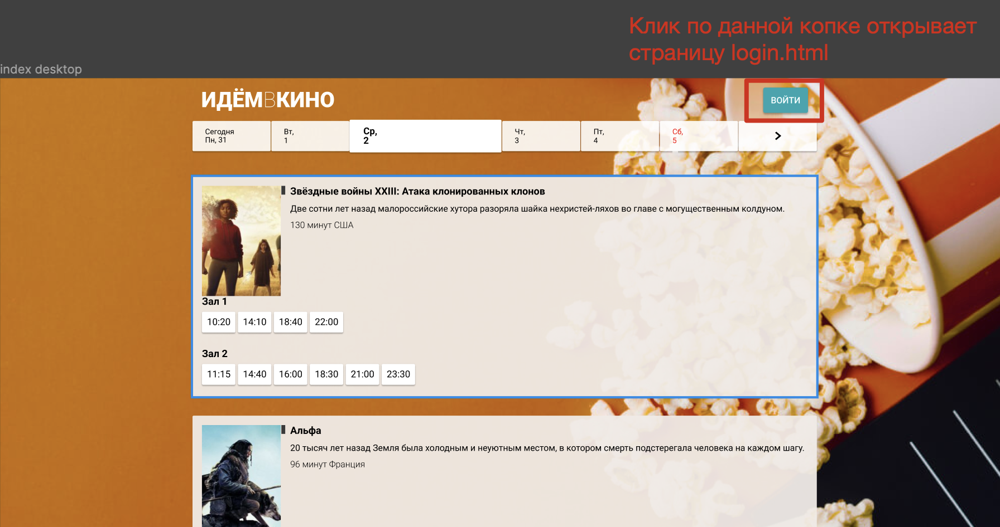
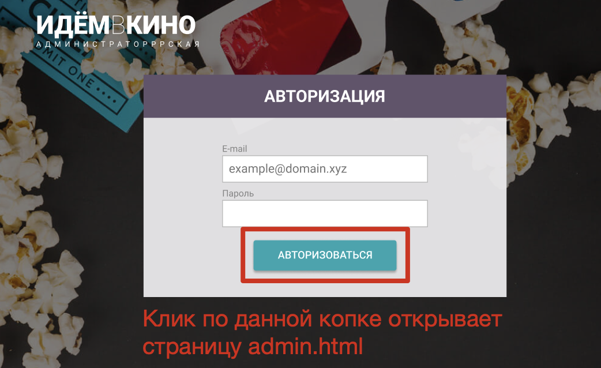

# Дипломная работа по курсу «Вёрстка на HTML и CSS: адаптивная и мобильная»

* [Цели дипломной работы](#цели-дипломной-работы)
* [Инструменты и дополнительные материалы](#инструменты-и-дополнительные-материалы-которые-пригодятся-для-выполнения-работы)
* [Описание проекта](#описание-проекта)
   * [Файловая структура проекта](#файловая-структура-проекта)
   * [Переход между страницами](#переход-между-страницами)
   * [Десктопная версия](#десктопная-версия)
   * [Планшетная версия ](#планшетная-версия)
   * [Мобильная версия](#мобильная-версия)
* [Требования к верстке](#требования-к-верстке)
   * [Кроссбраузерная вёрстка](#кроссбраузерная-вёрстка)
   * [Вёрстка всплывающей формы (pop-up)](#вёрстка-всплывающей-формы-(pop-up))
* [Правила приема работы](#правила-приема-работы)
  * [Как сделать самопроверку перед финальной сдачей диплома](#Как-сделать-самопроверку-перед-финальной-сдачей-диплома)
  * [Как задавать вопросы руководителю по дипломной работе](#Как-задавать-вопросы-руководителю-по-дипломной-работе)

## Цели дипломной работы

В дипломной работе вы сверстаете сайт для бронирования билетов в кинотеатр, состоящий из нескольких страниц.

В результате выполнения дипломной работы вы:
- разработаете сайт бронирования билетов онлайн,
- разработаете административную часть сайта.

## Инструменты и дополнительные материалы, которые пригодятся для выполнения работы

- [Макеты страниц в Figma](https://www.figma.com/file/WKuiURvXHT8e5lGaOcTlBA/Дизайн-макет?type=design&node-id=0-1&mode=design&t=ddn7TMlhdssoyXsu-0)
- [Методология БЭМ](https://ru.bem.info/methodology/quick-start/)

## Описание проекта 

### Файловая структура проекта

- fonts - папка содержит шрифты проекта
- css - папка содержит стили проекта
- img - папка содержит графику (картинки) проекта
- index.html -  главная страница
- login.html - страница авторизации
- admin.html - страница управления контентом (создание и удаление новых залов фильмов и сеансов)
- hall.html - страница выбора посадочного места на выбранный сеанс
- payment.html - страница подтверждения бронирования
- ticket.html - страница с сгенерированным QR кодом.

### Переход между страницами

1. Главная страница `index.html`
2. Переход на страницу `hall.html` осуществляется при клике по ссылке с сеансом на странице `index.html`  

3. Переход на страницу `payment.html` осуществляется при клике по кнопке **_"Забронировать"_** на странице `hall.html`  

4. Переход на страницу `ticket.html` осуществляется при клике по кнопке **_"Получить код бронирования"_** на странице `payment.html`  

5. Переход на страницу `login.html` осуществляется при клике по кнопке **_"Войти"_** на странице `index.html`  

6. Переход на страницу `admin.html` осуществляется при клике по кнопке **_"Авторизоваться"_** на странице `login.html`  

* Чтобы перейти на нужную страницу при клике по ссылке (элементу `a`), пропишите путь к странице (к html файле) в атрибуте `href` для ссылки.  
Например `<a href="hall.html">10:00</a>`
* Чтобы перейти на нужную страницу при клике по кнопке (элементу `button`), задайте для кнопки следующий атрибут `onclick="location.href='путь_к_файлу'`.  
  Например `<button href="login.html">Войти</button>`

### Десктопная версия

- Ширина контента фиксированная и составляет 990px
- Контент всегда располагается по центру экрана
- Breakpoints `min-width: 991px`

### Планшетная версия 

- Ширина контента 100%
- Breakpoints `max-width: 990px` and `min-with: 641px`

### Мобильная версия

- Ширина контента 100%
- Breakpoints `max-width: 640px`
- Верстка должна корректно отображаться на устройствах с шириной экрана **от 360px**

## Требования к верстке

### Кроссбраузерная вёрстка
В рамках проекта свёрстанные макеты должны корректно отображаться на следующих типах устройств:
- компьютерах с операционными системами Windows и macOS,
- планшетах и смартфонах с операционной системой iOS,
- планшетах и смартфонах с операционной системой Android.

Кроме поддержки основных типов устройств требуется, чтобы вёрстка корректно работала в следующих браузерах:
- Последняя версия Google Chrome,
- Последняя версия Mozilla Firefox,
- Последняя версия Edge,
- Последняя версия Opera,
- Последняя версия Safari,
- Последняя версия Mobile Safari,
- Последняя версия Mobile Chrome.

Если у вас нет какого-то устройства или программы, постарайтесь их найти или используйте эмуляторы, встроенные в браузер. Тестирование на реальных устройствах — важный навык современного специалиста.

### Соответствие вёрстки макету
Итоговый проект должен быть копией макетов, предоставленных дизайнером. При реализации допускаются небольшие отличия:
- толщина шрифта в браузерах и фотошопе,
- межсимвольное расстояние,
- различия в отступах до `5px`.

### Вёрстка всплывающей формы (pop-up)
Административная часть сайта содержит всплывающие формы. Свёрстанные формы должны отображаться по центру экрана — поверх вуали, затемняющей страницу.

**Вам не нужно реализовывать всплытие формы и их скрывание при клике на крестик.** Достаточно, чтобы форма была в разметке и ваш дипломный руководитель мог её найти.

После того, как закончите с вёрсткой всплывающего окна, добавьте блоку класс `_hidden` и задайте этому классу свойства, скрывающие блок.

### Валидная вёрстка
После полной реализации вёрстки протестируйте её с помощью сервиса [W3C Markup Validation Service](https://validator.w3.org). В итоговом отчете не должно быть ошибок или предупреждений.

### Реализация сетки
Реализовать сетку страницы вам нужно при помощи `flexbox` или `grid`. Использование библиотек, которые уже имеют готовые классы для сетки (Twitter Bootstrap, Zurb Foundation и другие), будет считаться ошибкой.

Также ошибкой будет считаться использование следующих способов вёрстки сетки:
- таблицы,
- float-сетка,
- сетка с помощью `inline-block`-элементов,

### Добавление меньшего или большего количества контента в блоки
Нужно протестировать блоки с информацией, добавив в них больше или меньше контента, чем представлено в макетах. Блоки не должны сломать соседние блоки, текст при этом должен быть полностью читаемым.

### Ошибки загрузки изображений
При вёрстке изображений вам нужно предусмотреть ситуацию, когда по какой-либо причине они не загрузятся.

- В случае контентных изображений вёрстка не должна сломаться, а вместо изображения должен отображаться альтернативный текст, из которого станет понятно, что было изображено на картинке.
- Для декоративных изображений вам необходимо подобрать подложки для текста, чтобы текст был читаемым в любой ситуации.

### Использование CSS-методологии
В наименовании CSS-классов желательно придерживаться методологии [БЭМ](https://ru.bem.info/methodology/quick-start/)

### Не используйте готовые библиотеки
В рамках дипломного проекта не следует использовать готовые библиотеки — normalize.css, reset.css, bootstrap и другие. Весь код вы должны написать самостоятельно.

### Не используйте CSS-препроцессоры или PostCSS
В рамках курса мы не рассматриваем способы организации кода с использованием CSS-препроцессоров и PostCSS. Поэтому в дипломе вам не следует их использовать.

### Не используйте autoprefixer
Для реализации кроссбраузерной вёрстки дипломного проекта вам не потребуется autoprefixer, поэтому его использование не приветствуется.

### Оформление кода
Дипломный проект должен соответствовать принятому стилю кода для [HTML](https://github.com/netology-code/codestyle/tree/master/html) и [CSS](https://github.com/netology-code/codestyle/tree/master/css). В случае ошибок в оформлении проект не может быть принят и будет отправлен на доработку.

### Правила приема работы

В личном кабинете отправлена ссылка на ваш ***Git-репозиторий***, в котором содержатся:
- все файлы проекта,
- файл Readme со ссылкой на ваш проект, опубликованный на githubPage

## Как сделать самопроверку перед финальной сдачей диплома
1. [ ] Проверить верстку на устройствах различной ширины.  
Верстка должна корректно отображаться на устройствах с шириной экрана `360px` **и более**
2. [ ] Проверить каждую страницу на [Валидаторе]((https://validator.w3.org)).  
Допускаются ошибки уровня warning, ошибки уровня error обязательно нужно исправить.
3. [ ] Проверить переход между страницами (подробнее см [тут](#Переход-между-страницами))  
Переход по страницам должен работать корректно
4. [ ] Свериться с макетом при ширине экрана устройства `1660px`, `768px` и `390px`  
Допускаются расхождения в расположении элементов не более `5px`

## Как задавать вопросы руководителю по дипломной работе

1. Если у вас возник вопрос, попробуйте сначала самостоятельно найти ответ в интернете. Навык поиска информации пригодится вам в любой профессиональной деятельности. Если ответ не нашёлся, можно уточнить у руководителя по дипломной работе.
2. Если у вас набирается несколько вопросов, присылайте их в виде нумерованного списка. Так дипломному руководителю будет проще отвечать на каждый из них.
3. Для лучшего понимания контекста прикрепите к вопросу скриншоты и стрелкой укажите, что именно вызывает вопрос. Программу для создания скриншотов можно скачать [по ссылке](https://app.prntscr.com/ru/).
4. По возможности задавайте вопросы в комментариях к коду.
5. Формулируйте свои вопросы чётко, дополняя их деталями. На сообщения «Ничего не работает», «Всё сломалось» дипломный руководитель не сможет дать комментарии без дополнительных уточнений. Это затянет процесс получения ответа. 
6. Постарайтесь набраться терпения в ожидании ответа на свои вопросы. Дипломные руководители Нетологии – практикующие разработчики, поэтому они не всегда могут отвечать моментально. Зато их практика даёт возможность делиться с вами не только теорией, но и ценным прикладным опытом.  
